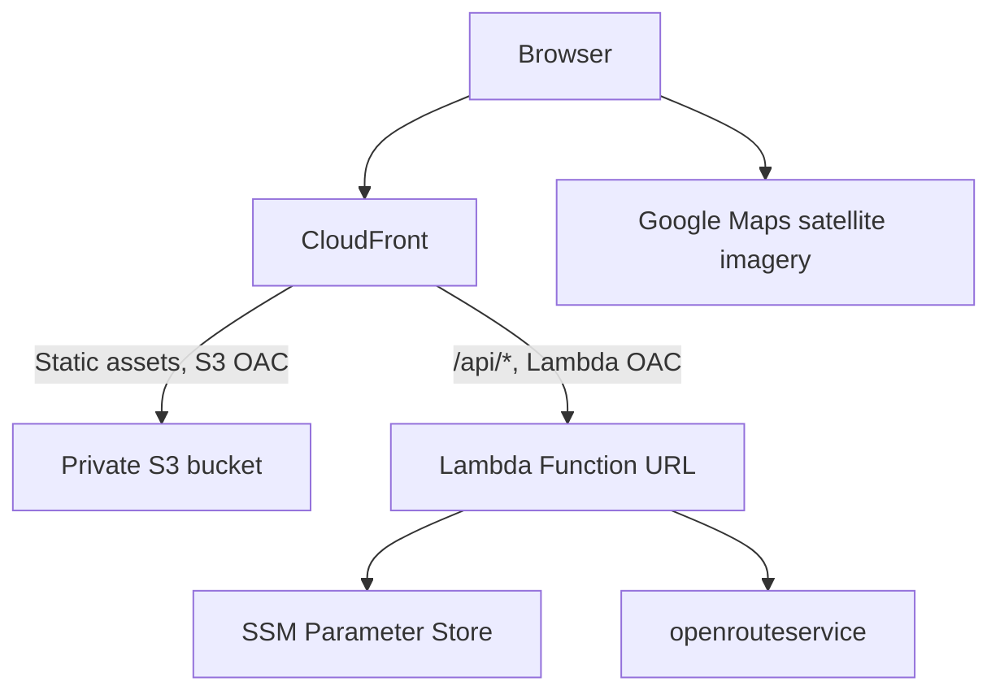

# Route Runner architecture

Route Runner helps a runner inspect approximate circular routes before setting
out. It ranks pedestrian loops by distance, repetition and relative hill
preference. It does not provide live navigation or guarantees about access,
surfaces or safety. Product requirements are in [SPECIFICATION.md](SPECIFICATION.md).

## Request flow

The frontend is a static React/TypeScript application in
`infrastructure/frontend`. The Lambda TypeScript application and its tests live
in `infrastructure/lambdas`. `packages/contracts` owns the shared request and
response definitions and runtime validation. Terraform environment roots stay
in `infrastructure/terraform/environments`, with reusable application resources
in `infrastructure/terraform/modules/routes`.

The browser sends route requests to the same-origin `/api/routes` endpoint. It
serializes the request once, computes its SHA-256 hash and sends those same bytes
with `x-amz-content-sha256`. CloudFront signs the origin request; the browser
receives no AWS credentials. This is origin protection, not user authentication.
The API remains public through CloudFront.

The backend validates requests, obtains a cached routing credential from SSM
Parameter Store and requests bounded candidate loops through a provider adapter. It
validates and scores candidates, removes similar loops and returns up to three
options. Elevation availability is explicit. Hill preferences rank the generated
candidates; they cannot establish the globally flattest route.

The Google browser key is deliberately public and must be restricted by API and
website. Routing credentials stay in the backend. Route generation does not
require an AI model, database, VPC or NAT gateway.

## State and privacy

Current settings and routes are held in browser memory. Saving a favourite is
explicit and uses a versioned localStorage schema. Saved routes can be removed
individually or together. No accounts or cloud synchronisation are provided.
Provider storage permissions must be confirmed before releasing favourites with
live route data.

API responses are not cached. Routine backend logs must omit coordinates,
geometry, bodies, credentials and raw upstream responses. Terraform creates both SecureString parameters with prevent_destroy protection.
The operator populates their plain values manually; CI does not write them.

## Development and release

Routine development and automated tests use sample geometry and replaceable
provider clients. Sample routes are not evidence of real path connectivity or
routing quality. Live provider calls are opt-in, require a credential and consume
quota. The current implementation must pass the provider experiment before its
route quality or performance targets can be accepted.

The initial hosting target is the CloudFront hostname. Custom DNS is optional.
Existing environment configuration determines the deployment region; the S3
state bucket's region does not determine it. Deployment uses a saved infrastructure plan. Same-repository PRs deploy dev;
merge cleanup removes dev infrastructure while retaining API-key parameters.
Pushes to main deploy prod; manual runs can select either environment. Static hashed assets are
retained so earlier HTML continues to work and rollback remains possible.

See [RELEASE_CHECKLIST.md](RELEASE_CHECKLIST.md) for the provider experiment,
operator inputs, deployed security checks and rollback validation still required.
