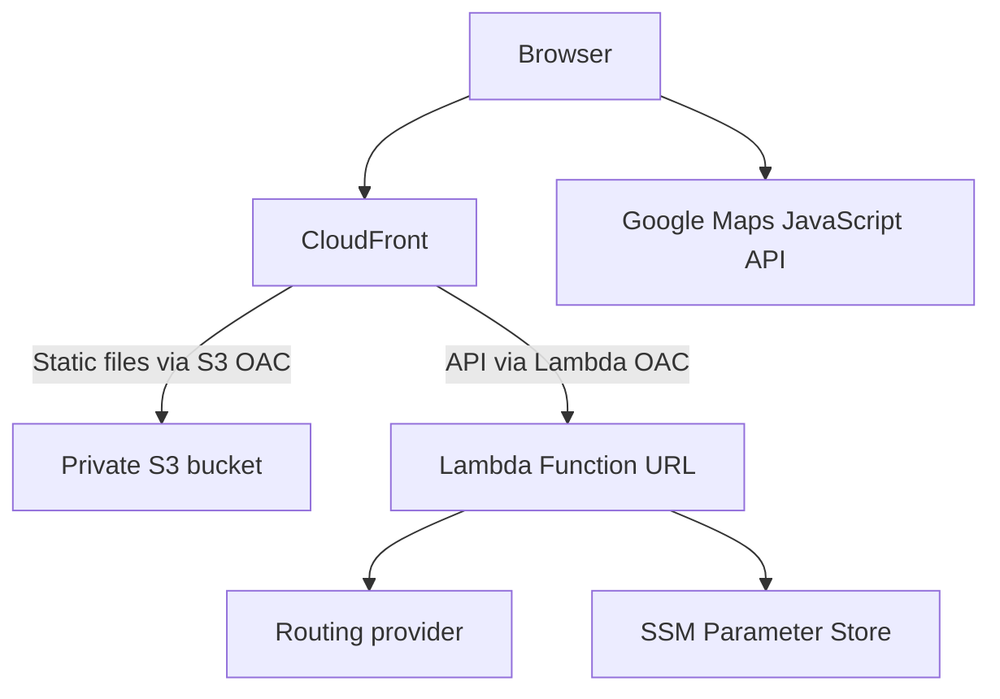

# Running route planner design

Version 1 • 4 October 2026 • Implementation handover for Aiden Vaines

## Purpose and status

Build a mobile-friendly web app that generates circular running routes of approximately 3, 5, 10 or a custom number of kilometres, taking hills into account. Display the routes on Google satellite imagery with distance, ascent and an elevation profile. The user can inspect and remember the route before running.

The agreed hosting architecture is a static frontend in S3, served by CloudFront, with a Lambda Function URL for the backend. API Gateway is not required. Watch export and navigation are deferred. This document authorises design and implementation work; it is not an instruction to deploy into an unspecified AWS account or incur provider charges.

Confirmed requirements and proposed implementation defaults are distinguished below. Agents should implement the defaults unless evidence from the provider spike requires a documented change. Avoid expanding scope into a fitness platform.

## Decisions and assumptions

| Item | Status | Decision |
|---|---|---|
| Hosting | Confirmed | S3, CloudFront and Lambda Function URL |
| Mapping | Confirmed | Google satellite imagery with route overlay |
| Distance | Confirmed | 3, 5, 10 km and custom |
| Elevation | Confirmed | Consider hills during route selection |
| Watch integration | Deferred | No route export or native Watch app in MVP |
| Route shape | Assumption | Loop returning to the selected starting location |
| Hill controls | Proposed | Flattest available, balanced and hilly |
| Routing provider | Proposed | Start with openrouteservice, behind an adapter |
| Frontend | Proposed | TypeScript, Vite and React; no SSR |
| Backend | Proposed | TypeScript on a currently supported Lambda Node.js runtime |
| Infrastructure | Proposed | Terraform, GitHub Actions and AWS OIDC |
| AWS region | Proposed | eu-west-2; CloudFront is global |
| Storage | Proposed | Browser favourites; no database |
| Surface preference | Unresolved | Roads and paths initially; do not claim pavement-only routing |

Use a compatible supported runtime and pin tool/provider versions at implementation time. No dependency on a specific runtime version is implied by this document.

## Scope

MVP includes choosing a start by browser location or map pin, preset/custom distance, a hill preference, candidate generation, up to three distinct route choices, kilometre markers, elevation profile, regenerate and browser favourites. Manual map placement must work when geolocation permission is denied. A map search box is optional: it introduces a separate geocoding/Places integration and should not block the first version.

Exclude accounts, cloud synchronisation, GPX export, Watch integration, live location tracking during runs, spoken directions, automatic rerouting, manual waypoint editing and offline satellite maps. Opening a route in Apple/Google Maps is a later experiment: destinations or waypoints may cause those apps to recalculate the path. Do not label such a link as preserving the exact generated route until verified.

## User experience

The initial screen has a satellite/hybrid map and a compact control panel. Ask for location only after the user selects “Use my location”. Show a start pin that can be moved. The controls offer 3/5/10/custom km and flattest available/balanced/hilly. Explain that distance is approximate.

Generate returns up to three alternatives under the selected hill preference, rather than overriding the preference to manufacture three categories. Cards show actual distance, ascent, distance difference and any quality warnings. Selecting a card highlights its polyline and elevation profile. Use kilometre markers, a clear start/finish marker and an optional simplified road/landmark summary where the provider supplies usable names. Do not imply that this summary is complete navigation.

Show progress while generating, prevent duplicate submits, and let users change settings after failure. Keep the last successful route visible when a later request fails. Ignore stale responses if the start or settings have changed. “Try different routes” uses a new seed. Return fewer options when fewer good candidates exist; never duplicate the same loop to fill the cards.

A reverse-direction feature is optional after the core flow. It must recompute directional gradients and any instructions, and respect directional access restrictions; reversing coordinate order alone is insufficient to establish route validity.

Favourites are stored explicitly in localStorage using a versioned schema. Users can delete individual favourites or clear them all. Browsing does not persist the current start automatically. Saved geometry may become stale; favourites show their creation date and can be regenerated.

## Architecture



Google maps requests go directly from the browser using a restricted browser API key. Routing requests go through Lambda, which validates input, controls provider usage, generates candidates and scores results. No AI model is needed. The routing provider performs pedestrian pathfinding; our code selects suitable loops.

Lambda runs outside a VPC unless a concrete requirement arises. It needs outbound HTTPS access to the provider; introducing private subnets and a NAT gateway adds unnecessary infrastructure and cost for this app.

### CloudFront behaviours and access

| Behaviour | Origin | Cache and method policy |
|---|---|---|
| Default | S3 REST origin, not website endpoint | GET/HEAD; cache hashed assets for a year |
| `/api/*` | Lambda Function URL HTTPS origin | Caching disabled; POST/GET/HEAD/OPTIONS supported; handler rejects other methods |

Redirect viewers to HTTPS. Use the CloudFront hostname initially; a custom domain and ACM certificate in us-east-1 are optional. Use `index.html` as the default root object and avoid client-side path routing in MVP. Do not globally convert origin 403/404 responses into index.html: this can mask API failures.

S3 blocks public access. Its bucket policy permits the CloudFront service principal only for this distribution. Use separate OACs with origin types `s3` and `lambda`. Lambda URL authentication is `AWS_IAM`; the Lambda OAC signs requests with SigV4 using signing behaviour `always`. Lambda resource permissions grant CloudFront both `lambda:InvokeFunctionUrl` and `lambda:InvokeFunction`, restricted to the distribution ARN. Apply URL-specific conditions where supported by the chosen Terraform resource and current AWS policy requirements. Direct unsigned invocation of the Function URL must fail. [1][2]

For POST, serialize the JSON once, encode it as UTF-8, compute its SHA-256 using browser Web Crypto, and send the lowercase hex digest in `x-amz-content-sha256`. Send the same bytes that were hashed. Forward this header and Content-Type to the origin. CloudFront supplies origin authentication; the browser receives no AWS credentials. [1]

Use an origin request policy that does not forward the viewer Host header, so origin signing uses the Lambda URL host. Forward only required headers where possible. The same-origin browser request needs no CORS configuration in production. For local development use the Vite proxy or a local backend adapter.

Disable API cache and return `Cache-Control: no-store` on success and errors. Never put route coordinates in API query strings. Restrict any SPA fallback to static paths. CloudFront may require an allowed-method set containing more methods than the app uses; enforce the actual method allowlist in Lambda.

## API contract

Use JSON schemas or equivalent runtime validation as the authoritative shared contract. Document it in OpenAPI and share generated or common TypeScript types; compile-time types alone do not validate external input.

`POST /api/routes`

```json
{
  "start": { "latitude": 53.8008, "longitude": -1.5491 },
  "distanceMetres": 5000,
  "hillPreference": "flat",
  "seed": 1729
}
```

`hillPreference` is `flat`, `balanced` or `hilly`. `seed` is an optional non-negative 32-bit integer; generate one if omitted and echo it in the response. The user cannot choose provider URLs, candidate counts, concurrency or unrestricted provider options.

Proposed validation: finite latitude [-90,90], longitude [-180,180], integer distance 1000–30000 metres, request body at most 8 KiB, correct content type, supported enum values and no unexpected fields. Convert custom kilometres to integer metres in the frontend. Limits are configuration and must match frontend/backend validation.

Successful response shape below uses deliberately abbreviated illustrative geometry; production routes must contain the complete path and matching profile.

```json
{
  "schemaVersion": 1,
  "requestId": "generated-id",
  "seed": 1729,
  "requestedDistanceMetres": 5000,
  "routes": [
    {
      "id": "route-1",
      "distanceMetres": 5080,
      "ascentMetres": 64,
      "descentMetres": 64,
      "distanceErrorPercent": 1.6,
      "elevationQuality": "available",
      "geometry": {
        "type": "LineString",
        "coordinates": [[-1.5491, 53.8008], [-1.5489, 53.8010]]
      },
      "elevationProfile": [
        { "distanceMetres": 0, "elevationMetres": 40 },
        { "distanceMetres": 25, "elevationMetres": 41 }
      ],
      "warnings": [],
      "roadSummary": []
    }
  ],
  "warnings": [],
  "attribution": {
    "routingProvider": "openrouteservice",
    "text": "Provider supplied attribution"
  }
}
```

Coordinates in GeoJSON are `[longitude, latitude]`, unlike the input object. Elevation profile distance is monotonically increasing along the full path. Route metrics are computed before display simplification. Missing elevation uses `elevationQuality: "unavailable"`, nullable ascent/descent and an empty profile; do not replace missing values with zero.

Errors use `{ "error": { "code": "INVALID_REQUEST", "message": "...", "requestId": "..." } }`. Statuses: 400 invalid input; 405 method unsupported; 413 body too large; 415 content type unsupported; 422 no usable route; 429 application/provider throttling; 502 upstream failure or unusable provider response; 504 exhausted request deadline. Return 200 with warnings when useful partial results exist. Include Retry-After for 429 where known. Do not expose upstream credentials or raw provider error bodies.

An optional `GET /api/health` checks process responsiveness without contacting the routing provider or returning secrets.

## Candidate generation and ranking

First implement a provider adapter with `generateRoundTrip(start, distance, seed, deadline)`. Use openrouteservice pedestrian round-trip routing and request elevation. Its documented round-trip options include length, points and seed; elevation and additional route details are available, subject to endpoint/profile compatibility. These must be tested together against the live hosted service before finalising requests. [3]

Proposed per-request pipeline:

1. Validate and normalise input; create an overall deadline and request ID.
2. Request up to six candidate loops with deterministic derived seeds; limit concurrent upstream calls to two.
3. Validate provider geometry, distances and elevation. Reject non-finite or malformed outputs and paths that fail to return near the start.
4. Compute quality metrics and remove duplicate or effectively identical loops.
5. Prefer candidates within 5% of requested distance. If needed, allow up to 10% with a visible warning. Reject candidates outside 10% in MVP and offer regeneration or a different target.
6. Rank remaining candidates using the selected hill preference and quality penalties; select up to three with diversity between them.
7. Return partial results if some provider calls fail, subject to the deadline.

Do not retry every failed candidate blindly. At most one bounded retry for a transient failure when time remains, respecting Retry-After; no retries for invalid input or authentication failure. Count retries against an absolute ceiling of eight upstream attempts. These are initial tunable limits, not a provider throughput promise.

### Quality metrics

Measure relative distance error, cumulative ascent per kilometre, sustained steep uphill distance, repeated-edge distance, tight reversals and similarity to other candidates. A loop's start and finish must be within a proposed 50 metres of the requested start and of each other; report road snapping rather than silently moving the start substantially. Parameterise the tolerance and validate it in local fixtures.

Use provider ascent/descent where trustworthy; derive sustained gradients from a smoothed, distance-resampled profile. Starting proposal: resample at 25 metre spacing, smooth elevation noise and measure grade over 50–100 metre windows. Validate these choices with real routes. Avoid presenting the steepest adjacent sample pair as a reliable hill measurement. Never promise exact gradients from a coarse terrain model.

Detect repeated sections using matched/quantised road segments with spatial tolerance, not raw coordinate equality. Intentional short shared access to the start is acceptable. Initial soft penalty above 15% repeated distance and rejection above 40%; revise using local results. Deduplicate loops even if travelled in the opposite direction. Preserve several genuinely different alternatives rather than selecting only the top near-identical routes.

Ranking should use explicit, configurable penalties and stable tie-breaking. For `flat`, give the highest terrain penalty to ascent and sustained steep uphill sections. For `balanced`, favour distance accuracy, low repetition and moderate climbing. For `hilly`, prefer ascent while limiting repetition and distance error; cap the climbing reward so an excessive detour cannot win. Record the scoring formula and weights in code/documentation after calibration; arbitrary initial weights are not a validated model.

Hill preferences are relative rankings among generated routes. This does not find the globally flattest loop or guarantee a requested amount of climbing. If elevation is unavailable for all candidates, return usable distance-based routes with a clear warning that the hill preference could not be applied. Exclude unknown-elevation candidates from terrain comparison when sufficient known-elevation options exist.

Footpath connectivity, access and surfaces depend on map data. Do not infer pavement, lighting, current mud, open gates or legal access from satellite imagery. Until surface preferences are agreed and provider tags verified, label the mode “roads and paths” and avoid promising road-only or safe routes.

## Configuration and secrets

Keep behaviour parameterised. Use production-suitable defaults, with explicit overrides for smaller test environments; avoid `if prod then` logic. Configuration includes distance limits, candidate/attempt counts, upstream concurrency, deadlines, distance tolerances, snapping tolerance, overlap thresholds and ranking weights.

Store the routing credential as an SSM Parameter Store SecureString and fetch/cache it in the Lambda execution environment with a refresh strategy. Terraform creates the parameter with a write-only UNCONFIGURED placeholder (the real value is the plain API key, not JSON) and a scoped access policy. Populate the real value outside Terraform through an authorised parameter-management step; keep the write-only version unchanged so later applies preserve operator updates. Never pass the credential through an ordinary Terraform value that leaks into state. Use the default aws/ssm encryption key initially. Grant only ssm:GetParameter access to the specific parameter and logging permissions. Backend secrets must never enter Vite variables or frontend bundles.

The Google browser key is intentionally public. Restrict it by website referrers and required APIs, use separate local-development restrictions, set quotas, and enable billing alerts. Google Maps JavaScript API requires enabled billing; confirm the applicable pricing before release. [4][5]

## Performance and operations

Initial targets, to be measured: typical generation under 10 seconds; server deadline 20 seconds; Lambda timeout 25 seconds; browser timeout 30 seconds. Ensure CloudFront origin timeouts exceed the application deadline. Use AbortController for upstream HTTP calls and stop initiating candidates near the deadline. Configure reserved concurrency initially at two, with explicit overrides for testing. Concurrency limits bound simultaneous work, not total daily spend.

Start with 512 MiB Lambda memory and measure. Bundle code; do not download dependencies on invocation. Consider warm-environment provider clients and secret caching. No provisioned concurrency initially.

Structured logs include request ID, duration, provider status category, call count, candidate counts, rejection reasons and coarse scoring outcomes. Do not log exact start coordinates, full geometry, request bodies, credentials or full provider responses. Sanitise errors and review access-log fields before enabling CloudFront access logs. Suggested CloudWatch retention is 14 days.

Track errors, latency, throttles, Lambda concurrency and upstream usage. Alarm on sustained failures/throttles and set AWS and Google billing notifications. Budget alerts are notifications, not a hard spending cap. Operator kill switch: set Lambda reserved concurrency to zero to halt generation.

The API is public through CloudFront. OAC prevents direct origin access; it does not authenticate website users. A browser-supplied hash is payload integrity for signing, not authentication. CORS/referrer checks are not abuse controls. For broader public release, assess a CloudFront-associated WAF rate rule on `/api/*`; do not claim per-user limits without implementing them. Avoid storing a supposed private API token in the frontend.

## Build and deployment

Suggested repository structure:

```text
apps/web/
services/routes/
packages/contracts/
infra/terraform/
docs/
.github/workflows/
```

Use a local mocked provider for routine development and tests. Keep live-provider tests opt-in to avoid quota consumption. Record fixtures with secrets and precise personal start locations removed.

Terraform owns infrastructure and permissions. GitHub Actions uses OIDC with a trust policy scoped to the actual repository and deployment environment/branch. Bootstrap the deployment role and Terraform state backend separately. Use remote state with encryption and locking supported by the pinned Terraform/backend version. Pin providers and commit lockfiles.

CI builds the frontend/backend, runs focused checks, validates Terraform and produces a reviewable plan. Deployment updates Lambda, uploads immutable hashed assets first, then index.html with no-cache/revalidation headers, and invalidates index/config as needed. Never delete old assets immediately: previously cached HTML may reference them. Retain a previous Lambda artefact and frontend build for rollback. Infrastructure changes must apply the reviewed plan.

Use the CloudFront domain initially. Custom domain setup is optional and requires the user to supply domain/account details. Do not publish or choose accounts, credentials or billing thresholds by guesswork.

## Verification and acceptance criteria

The provider spike is the first implementation gate. Test several known road/path networks in West Yorkshire with 3, 5 and 10 km targets, all hill preferences and multiple seeds. Record actual distance, ascent, repeated sections, route plausibility, latency, quota usage and attribution. Confirm combined round-trip/elevation support and hosted-provider restrictions. If results are consistently poor, document an alternative provider before implementing bespoke pathfinding.

Focused automated tests should cover input validation, malformed upstream responses, distance tolerance boundaries, loop closure, duplicate/reversed loops, overlap, missing elevation, deterministic scoring, deadline cancellation, partial success and upstream throttling. Frontend tests should cover denied geolocation, stale responses, favourite schema changes and generating the exact hashed request bytes. Use fixture geometries that expose real failure modes rather than tests that merely repeat implementation constants.

Acceptance criteria:

- A mobile user can place a start and generate routes for every preset and a valid custom distance.
- Successful candidates meet the configured distance tolerance and return near their starting point; fallback tolerance is clearly marked.
- When terrain data exists, hill preference influences deterministic selection and ascent/profile are displayed consistently.
- Distinct candidates are shown without filling missing slots with duplicates.
- Satellite/hybrid map shows complete route geometry, start/finish and kilometre markers, with required attribution visible.
- Missing elevation, no route, provider timeout and throttling have useful UI states; previous successful results remain accessible.
- Favourites survive a reload and can be deleted; no cloud account is required.
- The deployed POST works through CloudFront with a body hash. Missing/mismatched hashes fail; direct unsigned Function URL calls fail.
- S3 cannot be read directly by an anonymous caller. API errors remain JSON and are never replaced with the frontend HTML.
- No routing secret or precise route data appears in bundles, Terraform state inputs or routine logs.
- Deployment can be repeated from documented configuration, with a demonstrated rollback and operator kill switch.

## Agent work packages

These packages are for the user's subsequent agent handover; no agents have been launched as part of this document.

| Package | Deliverable | Dependencies |
|---|---|---|
| Provider spike | Live compatibility report, anonymised fixtures, adapter proposal and quota/terms findings | Provider credential and agreed test area |
| Contract and routing | Runtime schemas, adapter, candidate ranking and focused tests | Spike findings; agree contract before integration |
| Frontend | Mobile controls, Google map overlay, elevation profile, API client and favourites | Shared contract; can start with fixtures |
| Infrastructure | Terraform, S3/Lambda OAC, IAM, SSM parameter access and deployment pipeline | AWS account/repository details; POST signing spike |
| Integration review | End-to-end acceptance results, operational README and unresolved issues | All packages |

Give contract ownership to one agent. Other agents propose schema changes rather than editing competing versions. Isolate work in branches/worktrees and integrate against fixtures first. Infrastructure and frontend can proceed in parallel after the shared contract is frozen; provider validation must precede claims about routing quality.

Suggested delivery order: provider and CloudFront POST spikes; contract and backend; fixture-driven frontend; integrated deployment candidate; field review of real routes; acceptance and release review.

## Open decisions and release gates

The user still needs to decide preferred surfaces: pavement, parks/footpaths or mixed. Agents may proceed with mixed pedestrian routing, clearly labelled, while this is unresolved. Exact hill scoring, provider suitability and performance targets remain to be validated, not promised.

Before deploying: identify AWS account, region, repository, provider subscriptions, Google project, billing limits/alerts and optional domain. Check routing-provider attribution, quotas, route storage/caching/export permissions and compatibility with the Google map display. Confirm Google terms for displaying third-party route overlays. Until reviewed, avoid shared server-side route caching and persistent route storage; browser favourites must also comply with applicable provider terms.

The current design makes personal use possible without accounts, but does not restrict use to Aiden. If access must be private, add an explicit authentication design before release rather than relying on an obscure URL.

## References

Primary sources consulted on 4 October 2026. Recheck current provider restrictions and framework/runtime support during implementation.

1. AWS CloudFront Lambda origin access control — https://docs.aws.amazon.com/AmazonCloudFront/latest/DeveloperGuide/private-content-restricting-access-to-lambda.html — OAC, IAM origin access and POST payload hashes.
2. AWS Lambda Function URL access control — https://docs.aws.amazon.com/lambda/latest/dg/urls-auth.html — current invocation permissions and authentication model.
3. openrouteservice API specifications — https://github.com/GIScience/openrouteservice-docs — round-trip parameters and elevation options; live compatibility remains a spike requirement.
4. Google Maps JavaScript map types and billing — https://developers.google.com/maps/documentation/javascript/maptypes and https://developers.google.com/maps/documentation/javascript/usage-and-billing
5. Google Maps API security guidance — https://developers.google.com/maps/api-security-best-practices
